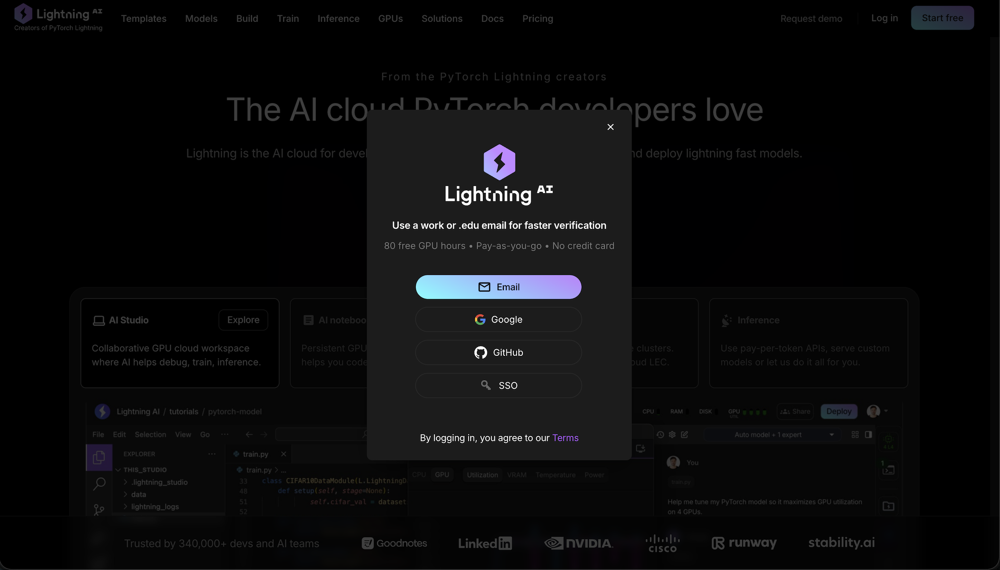
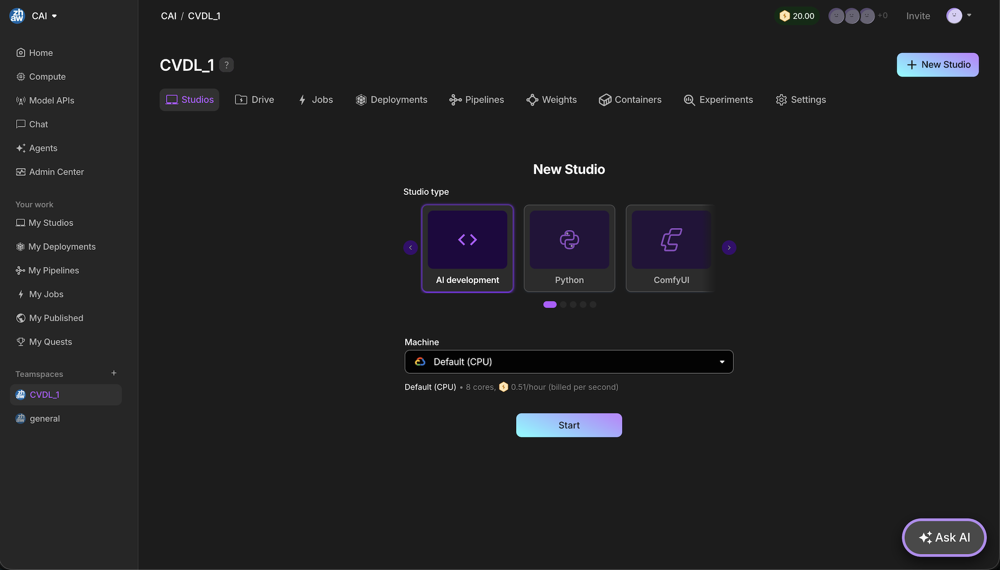
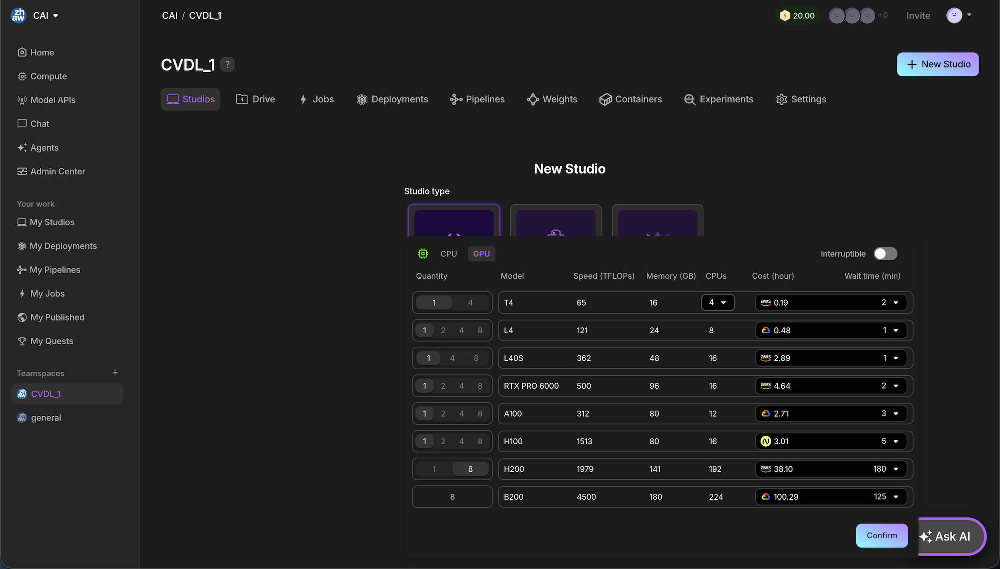
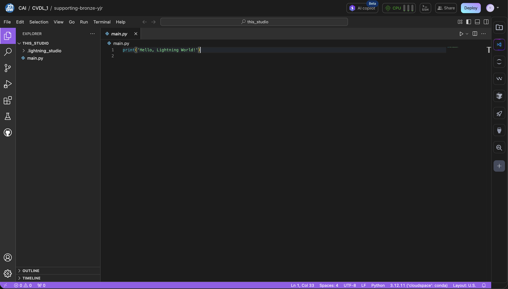
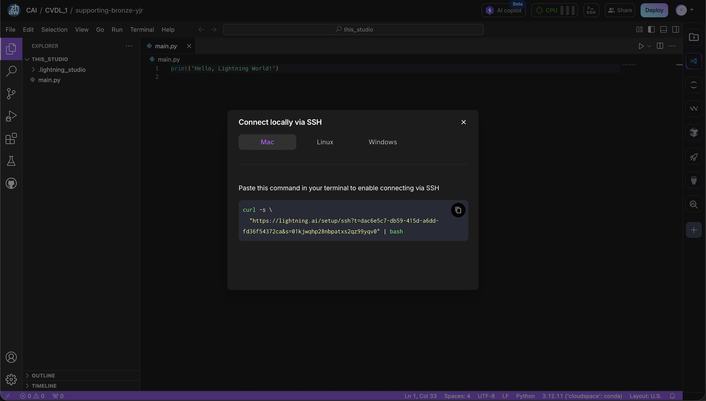
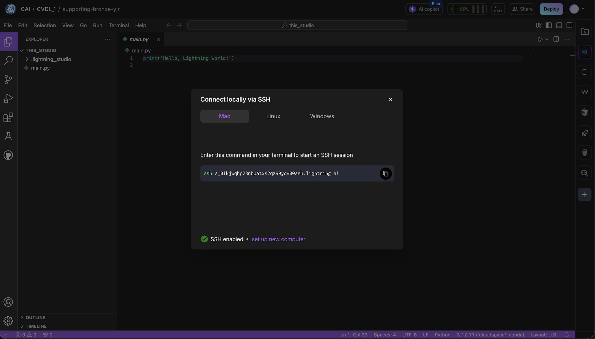

# Setup Instructions for Lightning AI

## Introduction

The Center for Artificial Intelligence @ ZHAW provides you with compute resources in the cloud. LightningAI allows you to run and edit your code directly in the browser and provides all kinds of compute resources.

---

## Step I: Register and Create an Account

1. Navigate to [https://lightning.ai](https://lightning.ai) and create an account.
2. Provide your **ZHAW student email address** and click on the confirmation link sent to your email.
3. The link directs you to your personal space on lightning.ai.

---

## Step II: Get to Know the Lightning AI Interface

### Navigate to Your Allocated Teamspace and Create a New Studio

1. Select the allocated **Teamspace** (e.g. `CVDL_1`).

2. Set up a new Studio:
   - **Type:** AI dev / Python
   - **Compute:** Select CPU or GPU resources based on your needs, including the number of GPUs and amount of memory.

Once started, the studio will open in your browser and look something like this:

---

## Step III: Working in the Studio

You can fully work in the browser by selecting the IDE of your choice from the right sidebar:

- VSCode
- Jupyter
- Windsurf
- Cursor

### Connecting via SSH (Optional)

You can also connect the studio to your local machine using SSH:

1. Click on the **Terminal icon** on the right side of the studio.
2. Click on **"Connect via SSH"**.
3. You will see an SSH command to generate an SSH key — copy it and run it in your **local terminal**.

4. This will create a new SSH key and configure it to connect to the studio.
5. A second command will be shown to actually connect — copy and run it in your local terminal.

You are now connected to the studio and can access it via terminal or the IDE of your choice.
